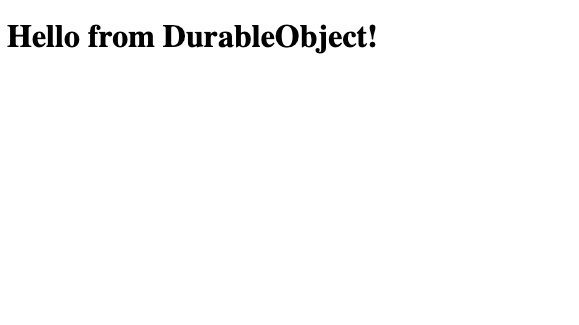

# SvelteKit Durable Object Local Usage Example

This is a simple example that shows how to use [`getPlatformProxy`](https://developers.cloudflare.com/workers/wrangler/api/#getplatformproxy) with SvelteKit's [`handle` hook](https://kit.svelte.dev/docs/hooks#server-hooks-handle) to get access to a local [Durable Object](https://developers.cloudflare.com/durable-objects/) declared and exposed by a [Cloudflare Worker](https://developers.cloudflare.com/workers/).

To run the example:

- install the dependencies:

    ```sh
    $ npm i
    ```

- run the worker and the svelteKit application with:

    ```sh
    $ npm start
    ```

- navigate to the svelteKit home (default `http://localhost:5173/`), you should see the following:

    

    showing a message that gets fetched from the Worker's durable object and displayed in the SvelteKit application